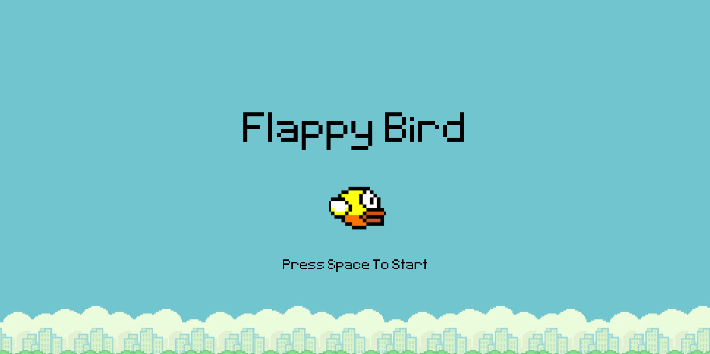
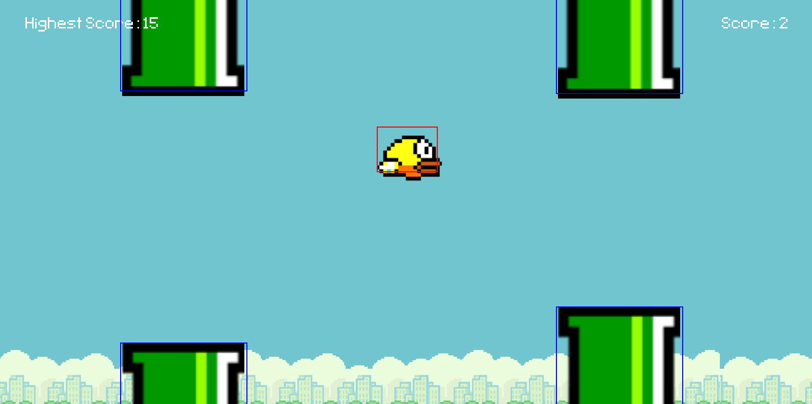
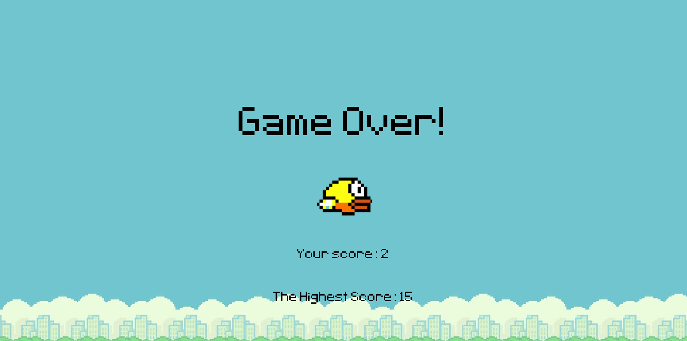

## Project: Flappy Bird Clone

## Table of contents

- [Overview](#overview)
  - [The challenge](#the-challenge)
  - [Screenshot](#screenshot)
- [My process](#my-process)
  - [Built with](#built-with)
  - [What I learned](#what-i-learned)
  - [Continued development](#continued-development)
  - [Useful resources](#useful-resources)
- [Author](#author)
- [Acknowledgments](#acknowledgments)

## Overview

### The Challenge
- learn pygame module.
- have a good understanding of Object-oriented Programming, which is very useful in organizing pygame program.
- implement game logics like moving background, spawning pipes, jumping, collisions, trigger game over etc.

### Screenshot

#### Start Menu

#### Gameplay

#### Gameover

## My Process
### Built With
- Python (pygame module) 

### What I learned
After this project, my key takeaways are
1. grasping the concept of Object-oriented Programming (OOP) to better organize related code together.
2. turning ideas into logics.
3. reading pygame documentation.

### Continued Development
In the future, I would like to implement more features to make the game more interesting.
- trouble shooting:
  - scoring issue - score 0 and game over -> display score.
  - pipe gap optimization - suitable algorithm to get optimal gap size.

- enemy
  - flying enemy - attack mechanism
  - plant enemy from pipe - movement
  - add collision - to reduce health by 1

- bird 
  - attack mechanism - shooting - auto or manual?
  - self control mode?
  - introduce health - max health = 3
  - sprint - introduce energy system - eg. to escape from vertical-moving pipes

- pipe 
  - more variations
  - different angle
  - moving pipes up and down

- screen optimization
  - get background with 1920 x 1080
  - better title font
  - better game over screen

- win or level
  - increase pipe speed after certain score?
  - certain score - change background? show up level 1, 2, 3...
  - reach 100 - winning scene?

  ### Useful Resources
  - [The ultimate introduction to Pygame](https://youtu.be/AY9MnQ4x3zk?si=exiBjpkIam9iNmIp) - I highly recommend anyone who wants to jump right into learning pygame as he covers the most basic concepts of pygame that can make you competent making simple game. This video also teaches me about OOP that further consolidates my understanding of the concept.
  - [Python Pygame: Looping Background](https://www.askpython.com/python-modules/pygame-looping-background) - This webpage taught me about how to realise the effect of infinite moving background during gameplay.
  - [Pixilart](https://www.pixilart.com/draw/flappy-bird-af0783d894) - I used this template to get and modify flappy bird to get different png, and draw pipes.

## Author
- GitHub - [@WeiXinToo](https://github.com/WeiXinToo/)

## Acknowledgments

I would like to express my sincere gratitude towards youtuber - [ClearCode](https://www.youtube.com/@ClearCode) for the amazing and captivating tutorial that get me started with pygame.